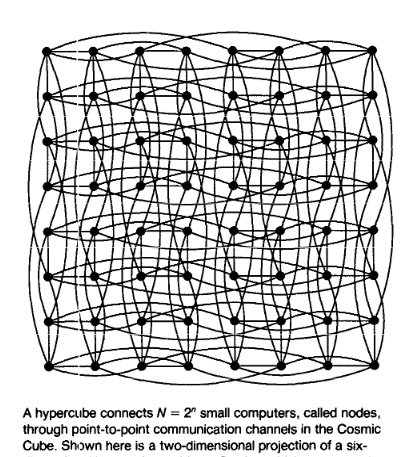

# Sobre este sitio.

Los tiempos en la que vivimos nos proporcionan una oportunidad única en la
historia: definir exactamente qué cara de nuestra personalidad queremos revelar
al mundo.  
Lo curioso es que ésto lo hacemos forma implícita. No le decimos al
mundo quiénes somos exactamente, sino que día tras día hacemos una curación de
contenido con el cual nos identificamos: imágenes, noticias, series, música y
tweets que consumimos y utilizamos como elementos con los cuales pintar nuestra
personalidad en el vasto y anónimo lienzo de las redes sociales, tratando
desesperadamente de separarnos del ruido, de ser distinguibles entre un mar de
perfiles indistinguibles el uno del otro, todos sujetos a la misma realidad a la
que nos enfrentamos todos los días en un mundo hiperconectado: una saturación
crónica de información. Un amalgamiento de chistes, memes y malas noticias que
permean todos los aspectos de nuestra vida diaria.

Teniendo tantas oportunidades de decir lo que quiero decir indirectamente,
quisiera hacer justo lo opuesto: expresar mi pensar de la forma más clara y
articulada posible.  
Hay veces en las que después de un día de consumo intensivo
de internet, ya no se qué es lo que queda de mí y qué ha sido reemplazado por
razgos de caracter adquiridos, opiniones prestadas de personalidades con egos
grandes y una voz fuerte a la que le hemos dado demasiado peso e importancia.  
Probablemente no diga nada de valor para nadie, pues hablaré de cosas que me
importan a mí y en las que pienso en momentos de ocio en mi vida diaria.
Si eres un chismoso que está aquí buscando formarse una imagen más clara de quién 
soy y de las ideas que llenan mi cabeza: bienvenido, estás en el lugar correcto. 
