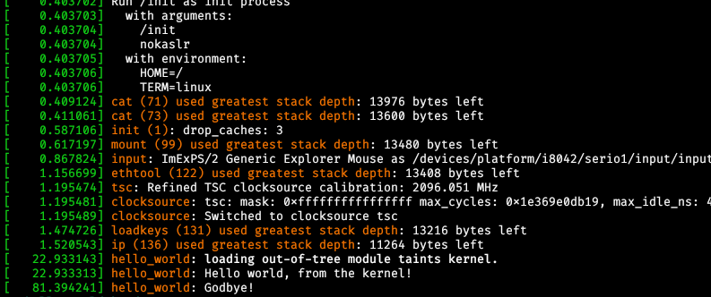

# Writing a simple linux kernel module with rust from the ground up.

:::date
27/04/2021
:::

Historically, if we wanted to write a kernel module, our only choice was to deal
with the C libraries the kernel provides for such things. However, a recent
[RFC](https://lkml.org/lkml/2021/4/14/1023) adds limited support for rust as an
alternative. 

## Setting up the toolchain

If you have a rust toolchain installed on your machine, then you probably also
have the [llvm toolchain](https://llvm.org/) and [rustup](https://rustup.rs/)
installed, so I won't get into that. 

Then, we need the actual
[rust-for-linux](https://github.com/Rust-for-Linux/linux) kernel tree. It is a
lengthy download over ssh so I recommend downloading as a zip.
We will unzip it in our directory of choice. The next step is configuring our
build for rust support. The process is documented  throughly in `Documentation/rust/quick-start.rst` 
The next step is to build the kernel. 

```Shell
$ make LLVM=1 -j $(nproc)
```

As of the day this post was written, nightly rust is needed for building.
We also need the standard library for compiling `core` and `alloc`.

```shell
$ rustup default nightly-2021-02-20
$ rustup component add rust-src
``` 


## Writing the code

The rust-for-linux project provides a standard toolset for writing a kernel
module. If you are familiar with the `hello world` module described in the book
_Linux Device Drivers_ (which if you haven't read, you should probably check out
before proceeding) then this will look familiar.

First, for the `hello_world.rs` file:

```rust
//! Hello world kernel module.

#![no_std]
#![feature(allocator_api, global_asm)]

use kernel::prelude::*;

module! {
    type: HelloWorld,
    name: b"hello_world",
    author: b"Carlos Carral",
    description: b"Hello world kernel module",
    license: b"GPL v2",
    params: {
    },
}

struct HelloWorld;

impl KernelModule for HelloWorld {
    fn init() -> KernelResult<Self> {
        pr_info!("Hello world, from the kernel!\n");

        Ok(HelloWorld {})
    }
}

impl Drop for HelloWorld {
    fn drop(&mut self) {
        pr_info!("Goodbye!\n");
    }
}
```

So far so good. This is almost the exact same source code as the one in
`samples/rust/rust_minimal.rs`. 

Next comes the makefile.

```Makefile
obj-m += hello_world.o

# Simply expanded variable ":="
KERNELDIR :=/path/to/rust-for-linux/linux

# Shell command expands to current working directory
PWD := $(shell pwd)

all: 
	$(MAKE) -C $(KERNELDIR) M=$(PWD) modules

clean:  
	rm -rf *.o *~ core .depend *.mod.o .*.cmd *.ko *.mod.c *.mod
	rm -rf *.tmp_versions *.markers .*.symvers modules.order
	rm -rf Module.symvers
	rm -rf *.rmeta 

```
We run `make` on our current working directory and 
if all went well, then the output of `ls` should look something like this.

```Shell
$ make LLVM=1
$ ls -1
hello_world.ko
hello_world.mod
hello_world.mod.c
hello_world.mod.o
hello_world.o
hello_world.rs
libhello_world.rmeta
Makefile
modules.order
Module.symvers
```

Great! Now what? 

Lets see what information we can get out of `hello_world.ko`

```shell
$ modinfo hello_world.ko

filename:       /home/carlos-II/Proyectos/rust/hello-world-kmod/hello_world.ko
author:         Carlos Carral
description:    Hello world kernel module
license:        GPL v2
depends:        
retpoline:      Y
name:           hello_world
vermagic:       5.12.0-rc4rust1 SMP mod_unload 
```

All seems well. Now let's try to actually load it.
You can install the kernel image into your system with `make install` or you can use
some sort of virtual machine to load it.
For this tutorial I used [eudyptula-boot](https://github.com/vincentbernat/eudyptula-boot).

## Loading our module

```Shell
$ insmod hello_world.ko 
```

An we unload it with `rmmod` 

```Shell
$ rmmod hello_world
```

Now, when we run `dmesg`, we can actually see how our module was loaded 
into the kernel and then unloaded.



An this is how we compile and load a rust kernel module.

