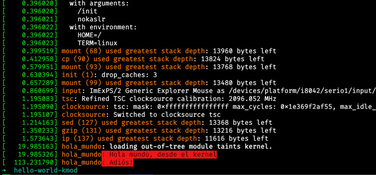

# Escribiendo un módulo de kernel de linux desde cero con rust

:::date
27/04/2021
:::

Históricamente, si queremos escribir un módulo de kernel para linux, nuestra
única opción es lidiar con las librerías de C dispuestas por el kernel para esos
motivos. Sin embargo, un nuevo [RFC](https://lkml.org/lkml/2021/4/14/1023)
propone añadir soporte para rust dentro del kernel. 


## Instalando nuestras herramientas
Si tienes un entorno de desarrollo instalado para rust en tu equipo, entonces
muy probablemente también cuentas con [rustup](https://rustup.rs/) instalado, por lo que
no profundizaré en ese aspecto.
También necesitarás el conjunto de herramientas de [llvm](https://llvm.org/)
disponible para tu versión de linux.  

Primero, necesitamos el código fuente de 
[rust-for-linux](https://github.com/Rust-for-Linux/linux). 
Es una descarga muy pesada a través de git y ssh, por lo que recomiendo
descargarlo en un zip.
Extraemos el código en un directorio de nuestra elección. El siguiente paso es
configurar las opciones para compilar el kernel. La manera más sencilla de
hacerlo es a través de 

```shell
$ make LLVM=1 menuconfig
```

y añadir la opción de soporte para
rust. El proceso está documentado de manera extensiva en
`Documentation/rust/quick-start.rst`
En el día en el que ésta publicación fue escrita, la versión _nightly_ de rust
es necesaria para activar ciertas funciones experimentales necesarias para la
compilación.
También necesitamos la librería estándar para compilar `core` y `alloc`.

```shell
$ rustup default nightly-2021-02-20
$ rustup component add rust-src
```


## Escribiendo el código

El proyecto _rust-for-linux_ provee de un conjunto de herramientas para escribir
un módulo de kernel. Si estás familiarizado con el código descrito para un
módulo de `hello world` en  _Linux Device Drivers_, entonces el siguiente código
será muy familiar para ti.

Comenzamos en un directorio de trabajo separado con el archivo 
`hola_mundo.rs`:

```rust
//! Módulo de ejemplo 'hola mundo'

#![no_std]
#![feature(allocator_api, global_asm)]

use kernel::prelude::*;

module! {
    type: HolaMundo,
    name: b"hola_mundo",
    author: b"Carlos Carral",
    description: b"Modulo de kernel hola_mundo",
    license: b"GPL v2",
    params: {
    },
}

struct HolaMundo;

// El módulo implementa la interfaz 'KernelModule', 
// la cual necesita una función de inicialización llamada init()
impl KernelModule for HolaMundo{
    fn init() -> KernelResult<Self> {
        pr_info!("Hola mundo, desde el kernel");
        Ok(HolaMundo{})
    }
}

// También es necesaria implementar la interfaz Drop, 
// pues será invocada cuando el módulo sea retirado del kernel.
impl Drop for HolaMundo{
    fn drop(&mut self) {
        pr_info!("Adiós!");
    }
}
```

Hasta ahora, el código es casi el mismo que el que está en
`samples/rust/rust_minimal.rs`. 

A continuación sigue el makefile para nuestro módulo.

```Makefile
obj-m += hola_mundo.o

# Variable simplemente expandida ":="
KERNELDIR :=/directorio/de/rust-for-linux/linux

# Se expande a nuestro directorio de trabajo
PWD := $(shell pwd)

all: 
	$(MAKE) -C $(KERNELDIR) M=$(PWD) modules

clean:  
	rm -rf *.o *~ core .depend *.mod.o .*.cmd *.ko *.mod.c *.mod
	rm -rf *.tmp_versions *.markers .*.symvers modules.order
	rm -rf Module.symvers
	rm -rf *.rmeta 

```
Ejecutamos `make` en nuestro directorio de trabajo y si todo salió bien,
entonces la salida de `ls` debería de verse así

```Shell
$ make LLVM=1 -j $(nproc)
$ ls -1
hola_mundo.ko
hola_mundo.mod
hola_mundo.mod.c
hola_mundo.mod.o
hola_mundo.o
hola_mundo.rs
libhola_mundo.rmeta
Makefile
modules.order
Module.symvers
```


¡Excelente! ¿Ahora qué sigue?

Podemos ver qué información obtenemos de `hola_mundo.ko`

```shell
$ modinfo hola_mundo.ko

filename:       /home/carlos-II/Proyectos/rust/hello-world-kmod/hola_mundo.ko
author:         Carlos Carral
description:    Modulo de kernel hola_mundo
license:        GPL v2
depends:        
retpoline:      Y
name:           hola_mundo 
vermagic:       5.12.0-rc4rust1 SMP mod_unload 
```
Todo parece indicar funcionó. Ahora intentaremos cargar el módulo al kernel
compilado. Primero necesitamos de _bootear_ nuestra imágen de kernel compilada.
Esto lo podemos hacer a través de `make install` o con una máquina virtual.
En mi caso elegí la segunda con
[eudyptula-boot](https://github.com/vincentbernat/eudyptula-boot) __Ojo:__
`eudyptula-boot` requiere que ciertas opciones sean añadidas a `.config` antes
de la compilación con `make`. 

Una vez que hayamos _booteado_ a nuestro kernel con alguna de las opciones
anteriores, podemos cargar nuestro módulo.

## Cargando el módulo al kernel

Cargamos nuestro módulo al kernel con `insmod`

```Shell
$ insmod hola_mundo.ko
[   19.985326] hola_mundo: Hola mundo, desde el kernel
```

y lo descargamos con `rmmod`

```Shell
$ rmmod hola_mundo 
[  113.231790] hola_mundo: Adiós!
```

Ahora, con `dmesg`, podemos ver los mensajes que nuestro módulo dejó en su
breve paso por el kernel.



Y es así como compilamos y cargamos un módulo de kernel de linux escrito en
rust.
