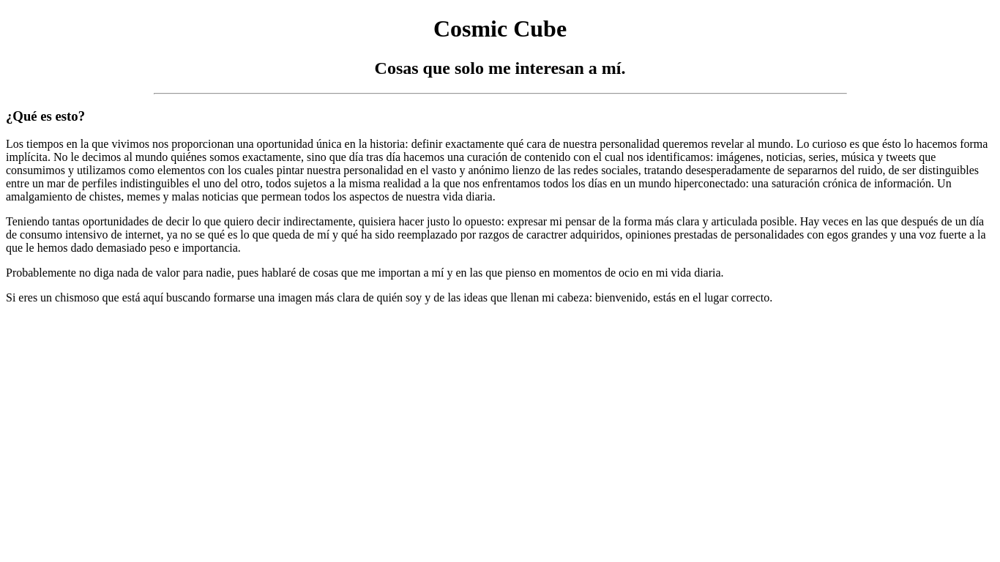
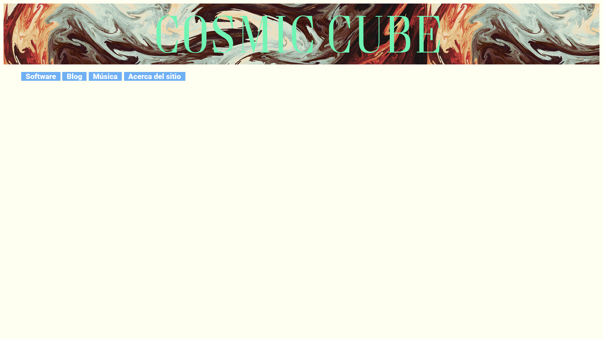
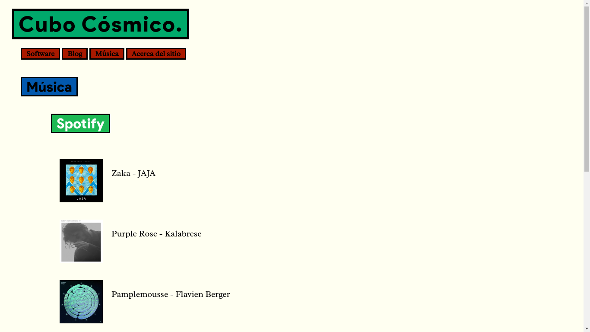

# Historia de este sitio.

::: date
23/10/2020
:::

Desde niño siempre he querido tener una página web. En parte, me fascinaba la
idea de tener un pequeño terreno sobre el cual construir mi casa en este vasto
mundo virtual. 

Mi primer sitio web fue escrito en Bloc de Notas. Un crudo "Hola Mundo" en HTML,
bajo la guía de la fuente universal del conocimiento para un niño en 2008: un
tutorial de Youtube. En ese momento, no sabía exactamente qué eran los verbos
HTTP,  no comprendía las sutilezas de la compra de un dominio web ni cómo
funcionaba un DNS (para ser justos, todavía no lo entiendo del todo). Satisfecho
con mi trabajo, apagué mi computadora y me salí a jugar lo que sea que los niños
de once años hacían en eso entonces.

Once años después, me encuentro solo y aburrido en la biblioteca de la escuela.
Mi mirada recae en un libro de "O'Reilly" con bonitas
portadas de animales. Eso me basta para, en la siguiente hora, dedicarme a hacer
una sencilla página en HTML.

No llegué mucho más lejos que once años atrás, pero al menos ya sabía (más o
menos) qué era lo que estaba haciendo. La hora terminó y me fui a mi clase sin 
hacer más por el momento.
El nombre ["Cosmic Cube"](https://www.computerhistory.org/collections/catalog/102746959) 
se anunciaba en mi cabeza, y ese fue el nombre experimental para mi sitio
durante toda la etapa de desarrollo.

Casi un año después, tuve la oportunidad de recibir un poco de entrenamiento sobre el conjunto
de tecnologías que componen el *stack* completo que un desarrollador web
debe dominar. Es aquí cuando los nombres Javascript y CSS comienzan a tener algún significado en mi vida.
Para eso entonces, ya creía saber lo suficiente de desarrollo web para
concretar un lejano sueño de la infancia. Lo que no sabía era que el descenso
por el agujero de gusano de la web moderna apenas comenzaba.

Cuando tomé la decisión de seriamente dedicarme al desarrollo de un blog
personal cometí un error imperdonable para alguien que pretenda ganarse la
vida escribiendo código: no fui claro conmigo mismo con los **requerimientos**
que tenía del sitio. Se me hizo fácil hacer llamadas indiscriminadas al API de Spotify. 
Fue la primera vez (y con un poco de suerte la única) que Google me jaló las orejas 
por publicar una llave privada de API en un repositorio git público.  

Comencé utilizando Handlebars.js y pronto me dí cuenta de que no sería
suficiente para las ideas megalómanas lo que tenía en mente. Entonces,
me dí a la tarea de aprender Vue.js como siguiente paso para convertirme en un 
desarrollador "full stack".

Resulta que Vue.js es una gran plataforma para programar un sitio web "serio":
una SPA con render asíncrono y un API serio, con backend en Node y PostgreSQL.
Sin embargo pronto recibí un cubetazo de agua fría: no tenía idea de en dónde 
iba a hostear mi sitio web. Hice las cuentas y el costo de un 
servidor + el nombre de un dominio + el costo de una base de datos en AWS era más 
de lo que estaba dispuesto a invertir en un proyecto de vanidad. 
Dejé el proyecto a un lado y me dediqué a terminar mi semestre.

Unos meses después, descubrí que github tiene la amabilidad de proveer de un
dominio completamente gratuito en su plataforma github pages. Esto era una gran
noticia, ya que esto significaba que no tenía que pagar un peso por el dominio y
hosteo de mi sitio web y las limitaciones de un sitio estático (como el que
puede ser hosteado en github) significaban un recorte significativo en mis
ambiciones para el sitio.

Un sitio estático. Esto quiere decir que este sitio pudo haber sido
escrito en su totalidad en HTML puro sin la necesidad de escribir una sola línea de
javascript.

Pero ya estoy aquí, y aprendí mucho en el camino. 

Como nota técnica, este sitio es compilado a su forma estática gracias a
prerender-spa-plugin, un plugin para webpack que compila una SPA a un página
estática.

Disfruta la página, tomó mucho tiempo y aprendizaje llegar hasta aquí. Gracias
por leer.

*Nota:*  
Desde la fecha de esta publicación, la insfraestructura del sitio ha cambiado.
Al día de hoy, utiliza [VuePress](https://vuepress.vuejs.org/) con un tema
personalizado, escrito 100% por mí.

